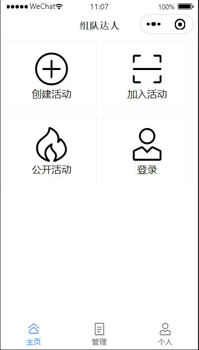
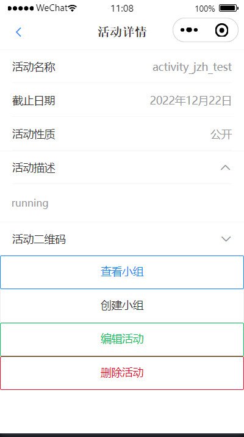
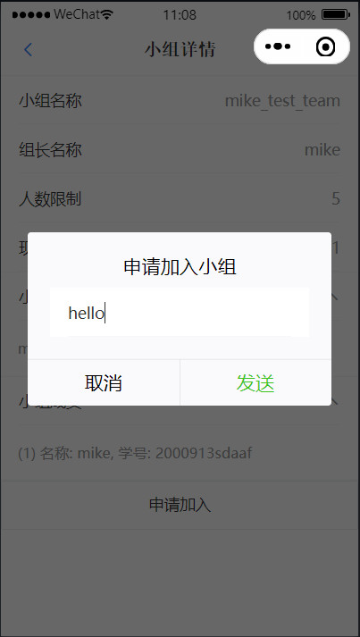
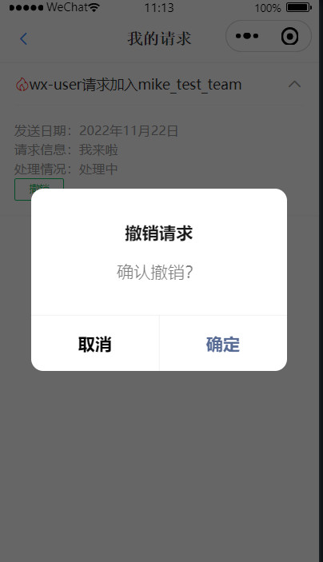

## 组队达人 (form-team-talent)

### 简介

一个简洁的小程序，可以快速，方便，高效地进行课外活动，课题研究，大作业等的组队。

[查看小程序展示](#show)

未部署到微信（尚无此打算）

### 技术说明

**后端部分：**

主要通过Java实现，通过Docker部署。

- SpringBoot
- Docker & Docker-compose
- MySQL
- MybatisPlus
- Hutool
- JWT
- Quartz
- OkHttp

**前端部分：**

主要由JavaScript实现。

只有微信小程序端，通过微信官方API和Vant Weapp框架搭建UI。

- WeChat API
- Vant Weapp

### 开发说明

#### 一、编辑配置文件

将 `application.pub.yaml` 重命名为 `application.yaml`，然后开始编辑：

”xxxxxx“为需编辑内容。

```yaml
spring:
  datasource:
    driver-class-name: com.mysql.cj.jdbc.Driver
    username: xxxxxx
    password: xxxxxx
    url: jdbc:mysql://localhost:3306/form_team_talent?serverTimezone=UTC&useUnicode=true&characterEncoding=utf8
  application:
    name: form-team-talent
  servlet:
    multipart:
      max-file-size: 10MB
      max-request-size: 20MB
  web:
    resources:
      static-locations: classpath:/static/

mybatis-plus:
  configuration:
    map-underscore-to-camel-case: false

server:
  port: 8080

wx:
  appId: xxxxxx
  appSecret: xxxxxx
  getOpenIdUrl: https://api.weixin.qq.com/sns/jscode2session

auth:
  jwt:
    secret: xxxxxx
    expire: xxxxxx

# 用于方便地获取外部静态地址，在外部application.yaml指定，此处不用修改，只是为了程序的正常运行
staticPath: ""

```

然后执行 `init.sql` 初始化数据库。

到此为止，即可进行基本开发，以下部分是部署操作。

#### 二、创建docker环境

需要挂载文件卷，用于容器与主机之间共享文件，选用linux主机上的 `/docker/**` 作为共享点。

- /docker/mysql/data:/var/lib/mysql # 数据挂载
- /docker/mysql/conf:/etc/mysql/conf.d # 配置挂载
- /docker/mysql/init:/docker-entrypoint-initdb.d # 初始化sql挂载
- /docker/app/form-team-talent:/docker/app/form-team-talent # 存放静态文件，jar包，外部配置等

注：挂载规则是{主机目录}:{容器目录}。

创建完对应目录后：

将 `init.sql` 放到 `/docker/mysql/init` 目录下。

在 `/docker/app/form-team-talent` 下创建 `static` 目录。

注：挂载的目录可自行指定，但后续相关部分需要进行修改。

#### 三、编辑外部配置文件

“xxxxxx”为需编辑内容。

```yaml
spring:
  datasource:
    username: xxxxxx
    password: xxxxxx
    url: jdbc:mysql://mysql-server:3306/form_team_talent?serverTimezone=UTC&useUnicode=true&characterEncoding=utf8
  web:
    resources:
      static-locations: file:/docker/app/form-team-talent/static

staticPath: /docker/app/form-team-talent/static
```

`staticPath` 对应于 `static-locations` 的 `file:` 之后的部分，它只是为了方便编程而存在。

然后将外部配置文件放到 `/docker/app/form-team-talent` 目录下即可。

注：对于 `static-locations`，若要自定义，需要注意docker容器中的位置需对应到主机上对应位置，并且需要将该位置进行挂载。

#### 四、编辑docker配置文件

首先将 `docker-compose-pub.yaml` 重命名为 `docker-compose.yaml`，然后开始编辑：

“xxxxxx” 为需编辑内容。

```yaml
version: '2.4.1'
services:
  mysql-server:
    image: mysql:8
    container_name: mysql-server
    ports:
      - 3306:3306
    environment:
      MYSQL_ROOT_PASSWORD: 'xxxxxx'
    volumes: # 需要挂载的文件卷，用于容器与主机之间共享文件
      - /docker/mysql/data:/var/lib/mysql # 数据挂载
      - /docker/mysql/conf:/etc/mysql/conf.d # 配置挂载
      - /docker/mysql/init:/docker-entrypoint-initdb.d # 初始化sql挂载
    restart: always
    command: # docker run {args}
      --default-authentication-plugin=mysql_native_password
      --character-set-server=utf8mb4
      --collation-server=utf8mb4_general_ci
      --explicit_defaults_for_timestamp=true
      --lower_case_table_names=1
  form-team-talent:
    container_name: form-team-talent
    build:
      context: .
      dockerfile: Dockerfile
    volumes:
      - /docker/app/form-team-talent:/docker/app/form-team-talent
    depends_on:
      - mysql-server
    ports:
      - 8080:8080
    restart: always
```

#### 五、开始出发！

方便起见，通过脚本实现快速部署。

第一运行的话， 在项目根目录下，执行 `./publish.sh -u` 即可：

```shell
if [ "$1" = "-u" ] # 更新jar包
then
  mvn clean && mvn package
  cp -a ./target/*.jar /docker/app/form-team-talent/app.jar
fi

docker-compose up --build -d
```

随后，若不涉及jar包更新，执行 `./publish.sh` 即可。

如下：

```shell
[root => ~/code/form-team-talent]$ ./publish.sh
[+] Building 0.1s (6/6) FINISHED
 => [internal] load build definition from Dockerfile                                           0.0s
 => => transferring dockerfile: 32B                                                            0.0s
 => [internal] load .dockerignore                                                              0.0s
 => => transferring context: 2B                                                                0.0s
 => [internal] load metadata for docker.io/ascdc/jdk8:latest                                   0.0s
 => [1/2] FROM docker.io/ascdc/jdk8                                                            0.0s
 => CACHED [2/2] WORKDIR /docker/app/form-team-talent                                          0.0s
 => exporting to image                                                                         0.0s
 => => exporting layers                                                                        0.0s
 => => writing image sha256:0274223a61acc7794b443779bf226443d107c3eda02d3ecf51825b9f049e670e   0.0s
 => => naming to docker.io/library/form-team-talent_form-team-talent                           0.0s

Use 'docker scan' to run Snyk tests against images to find vulnerabilities and learn how to fix them
[+] Running 2/2
 ⠿ Container mysql-server      Started                                                         0.4s
 ⠿ Container form-team-talent  Started                                                         0.8s
```

容器状态：

```shell
[root => ~/code/form-team-talent]$ docker ps
CONTAINER ID   IMAGE                               COMMAND                  CREATED             STATUS          PORTS                                                  NAMES
a77290b38aa2   form-team-talent_form-team-talent   "java -jar app.jar"      About an hour ago   Up 52 seconds   0.0.0.0:8080->8080/tcp, :::8080->8080/tcp              form-team-talent
081fd6d4c0b1   mysql:8                             "docker-entrypoint.s…"   About an hour ago   Up 53 seconds   0.0.0.0:3306->3306/tcp, :::3306->3306/tcp, 33060/tcp   mysql-server
```

部署完毕。

<h3 id="show">展示</h3>

**主页**



**个人页**


**管理页**


**活动页**




**小组页**


**请求**

发送加入小组的请求：



处理请求：




### 联系与交流

QQ: 1945561232

Wechat: akynazh

Mail: 1945561232@qq.com