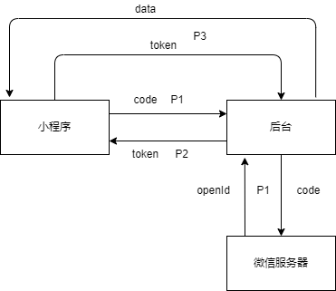

## 组队达人 (form-team-talent)

### 简介

一个简洁的小程序，可以快速，方便，高效地进行课外活动，课题研究，大作业等的组队。

[点击查看小程序展示](#show)

### 团队分工情况

- 江志航：40%，后端代码和部分前端代码
- 王飞扬：30%，界面设计和部分前端代码
- 汪运泽：30%，负责文档，PPT的编写和部分前端代码

### 功能设计

每个人都可以通过组队达人创建一个活动，活动可以设置为私有活动或者公共活动，可以指定截止时间和具体内容，其他人可以通过扫描二维码加入活动。

加入活动页面，可以创建自己的小组，小组可以设置人数限制，说明小组的目标，对成员的要求等等。

活动参与者可以申请加入小组，说明自己的情况，以便组长筛选组员，组长同意申请之后就成功加入了小组。

每个人可以编辑自己的具体信息，以便了解和认识其他人。

### 技术设计

#### 一、后端技术概览：

主要通过 Java 实现，支持通过 Docker 快速部署。使用微信云托管部署服务，使用腾讯云COS（或阿里云OSS）存储静态文件。

- SpringBoot
- Docker & Docker-compose
- MySQL
- MybatisPlus
- Hutool
- JWT
- Quartz
- OkHttp
- qcloud.cos / aliyun.oss

#### 二、前端技术概览：

主要由 JavaScript 实现。

只有微信小程序端，通过微信官方API和 **Vant Weapp** 框架搭建UI。

- WeChat API
- Vant Weapp

#### 三、关键技术点和问题：

**1、docker 部署问题**

如果不使用 docker-compose 部署服务，只通过 docker 进行部署的话，由于有多个容器需要部署且容器间需要通信，为了正常通信，需要建立桥接网络，通过创建一个 network（默认为 bridge 模式），将两个容器的网络均指定为该 network， 即可让两个容器互通。

对于 mysql 服务所在容器，假如容器名定为 mysqldb，那么在 java 后端配置文件里对应的 mysql 服务的 url 应该指定为 `jdbc:mysql://mysqldb/xxxxxxx`。这样才能顺利连通 mysql 服务。

当然，假如使用 docker-compose 则没有这个问题了。

**2、前后端交互认证问题**

微信小程序的认证流程大致是这样的：

**P1：**在小程序端向用户申请获得用户信息的权限，用户同意后，微信服务器返回一个 code 授权码，小程序端携带该授权码访问后端认证接口。

**P2：**后端通过该授权码访问微信提供的接口服务获得该用户的 openId，接着将 openId 通过 Jwt 进行加密生成 token，放入请求头中返回给小程序端。

**P3：**小程序端将 token 存入本地，以后每次需要用户认证的请求都带上该请求头。后端尝试获取请求头中 token，如果 token 不存在或者 token 过期则向小程序端返回 token 失效的错误码。

**P4：**如果小程序端收到 token 失效错误码后，则进行 P1 操作。

认证流程图如下所示：



**3、JavaScript 中嵌套异步编程：**

我们知道，只有在 async 函数中才能使用 await 字段，而 async 函数总是返回 Promise 对象，如果你需要在 Promise 对象中进行 await 呢？如果直接写，会报错：

```
await is only valid in async functions and the top level bodies of modules
```

这是作用域的问题导致的，在 Promise 中处在了另一个作用域中，从而检测不到外层的 async。

但由于可以在 Promise 内调用 async 函数，所以封装一个函数不就好了？如下：

```js
# 封装的函数
async function sendAuth(code) {
  return await app.call({
    url: '/api/user/auth?code=' + code,
    method: 'POST',
  })
}

# 调用封装的 async 函数
async function auth(pageUrl = "", redirect = 1) {
  wx.showLoading({
    title: "尝试登录..."
  })
  return new Promise((resolve, reject) => {
    wx.login({
      success(res1) {
        sendAuth(res1.code).then(
          res => {
            if (res.data.code == 200) {
              wx.hideLoading({
                success: () => { wx.showToast({ title: '登录成功' }) }
              })
              wx.setStorageSync('auth', res.header.auth)
              if (pageUrl != "") goToPage(pageUrl, redirect)
              resolve()
            } else {
              wx.hideLoading({
                success: () => { alertFail(`${res.data.msg}`) },
              })
              reject()
            }
          }
        )
      },
      fail() {
        wx.hideLoading({
          success: () => { alertFail("请检查网络") },
        })
        reject()
      }
    })
  })
}
```

**4、快速过滤目标对象**

关于加入小组的请求，可以是他人向自己的请求和自己向他人的请求，在这个基础上，又分为已处理的请求和未处理的请求，为了减少 sql 语句的编写和对数据库的压力，可以通过返回对象后再进行过滤来实现。

通过 Java8 的新特性 stream 可以很好地解决这个问题：

```java
// 过滤出符合type的
Predicate<JoinRequest> pType = req -> type == 0 ? req.getFromId().equals(uId) : req.getToId().equals(uId);
// 过滤出符合status的
Predicate<JoinRequest> pStatus = req -> req.getStatus().equals(status);

if (status == 2)
    return RestfulResponse.success(
            removeOpenId(requests.stream().filter(pType).collect(Collectors.toList()))
    );
if (type == 2)
    return RestfulResponse.success(
            removeOpenId(requests.stream().filter(pStatus).collect(Collectors.toList()))
    );
return RestfulResponse.success(
        removeOpenId(requests.stream().filter(pStatus).filter(pType).collect(Collectors.toList()))
);
```

如上，filter 指定好的 Predicate 即可。

**5、关于后端返回的 json 数据**

对于一个采用驼峰命名法命名的变量，比如 userId，转换后返回前端的 json 属性名是 userId，没有问题。

但是当变量名为 uId时，转换后则变为 uid，这就产生了问题。我还测试了其它一些变量，如下：

```
# userId
{"code":200,"msg":"ok","obj":{"userId":"hello"}}
# uId
{"code":200,"msg":"ok","obj":{"uid":"hello"}}
# Id
{"code":200,"msg":"ok","obj":{"id":"hello"}}
# uuId
{"code":200,"msg":"ok","obj":{"uuId":"hello"}}
```

可见当为 uId 和 Id 时，都会出现问题。

一般可以考虑在后端变量命名时，不让第二个字符大写，或者采用 `@JsonProperty("uId")` 进行解决。

### 后端开发步骤

将 `application.pub.yaml` 重命名为 `application.yaml`，然后开始编辑。（“xxxxxx...”为需编辑内容）

需要配置的内容：

- 微信小程序的 appId 和 appSecret
- 数据库用户和密码
- 对象存储相关字段
- 本地静态资源存储位置
- token 密钥和过期时间（单位：s）

然后执行 `init.sql` 初始化数据库。

之后，即可开始开发。

### 前端开发步骤

`mini-program` 为小程序开发目录，后端未使用微信云托管，需通过该文件夹开发。

`mini-program-cloud` 也为小程序开发目录，若后端使用了微信云托管，需通过该文件夹开发。

```
cd mini-program # or cd mini-program-cloud
npm init
npm install
```

然后，使用微信开发者工具进行npm构建即可。

接着，编辑 `app.js`，如下：

如果在 `mini-program` 开发，将“xxxxxx”替换为后端服务地址即可。

```js
App({
  globalData: {
    baseUrl: "xxxxxx",
  },
})
```

如果在 `mini-program-cloud` 开发，则需编辑如下内容（先将 app.pub.js 重命名为 app.js）：

```js
that.cloud = new wx.cloud.Cloud({
  resourceAppid: 'xxxxxxxxxxxxxxxxxx', // 微信云托管环境所属账号，服务商appid、公众号或小程序appid
  resourceEnv: 'xxxxxxxxxxxxxxxxxx', // 微信云托管的环境ID
})
```

之后，即可开始开发。

### 部署步骤

#### 方法1、通过 docker 部署

首先， docker 拉取 `mysql:5.7`

接着，编辑配置文件中 mysql 地址如下：

```
url: jdbc:mysql://mysqldb/form_team_talent?serverTimezone=UTC&useUnicode=true&characterEncoding=utf8
```

接着，编辑 `publish.sh` 中数据库密码（默认指定的是 root 的密码）。

最后，运行 `publish.sh -u`（-u 字段是为了重新生成 jar包），然后加入 mysql 容器运行数据库初始化脚本 `init.sql` 即可。

#### 方法2、通过 docker-compose 部署

首先，由于需要挂载文件卷，用于容器与主机之间共享文件，选用linux主机上的 `/docker/**` 作为共享点。

- /docker/mysql/data:/var/lib/mysql # 数据挂载
- /docker/mysql/conf:/etc/mysql/conf.d # 配置挂载
- /docker/mysql/init:/docker-entrypoint-initdb.d # 初始化sql挂载
- /docker/app/form-team-talent:/docker/app/form-team-talent # 存放静态文件，jar包，外部配置等

注：挂载规则是{主机目录}:{容器目录}。

创建完以上对应目录后：

将 `init.sql` 放到 `/docker/mysql/init` 目录下。

将 `docker-compose-pub.yaml` 重命名为 `docker-compose.yaml`，然后编辑数据库密码即可（默认指定的是 root 的密码）。

接着，编辑配置文件中 mysql 地址如下：

```
url: jdbc:mysql://mysqldb/form_team_talent?serverTimezone=UTC&useUnicode=true&characterEncoding=utf8
```

最后，执行 `./publish.sh -u` （-u 字段是为了重新生成 jar包）。

#### 方法3、通过微信云托管部署

在数据库界面创建账号（对应数据库用户和密码），进入数据库管理界面，运行数据库初始化脚本 `init.sql` 即可。

在数据库界面获取数据库内网地址，然后编辑配置文件中 mysql 地址如下：

```
url: jdbc:mysql://数据库内网地址/form_team_talent?serverTimezone=UTC&useUnicode=true&characterEncoding=utf8
```

重新生成 jar 包。

最后，进入服务界面，创建服务，将jar包上传并部署（或采用 docker 的方式）。

<h3 id="show">小程序展示</h3>

**主页**


**个人页**


**管理页**


**活动页**


**小组页**


**请求**

发送加入小组的请求：


处理请求：


### 联系与交流

QQ: 1945561232

Wechat: akynazh

Mail: 1945561232@qq.com