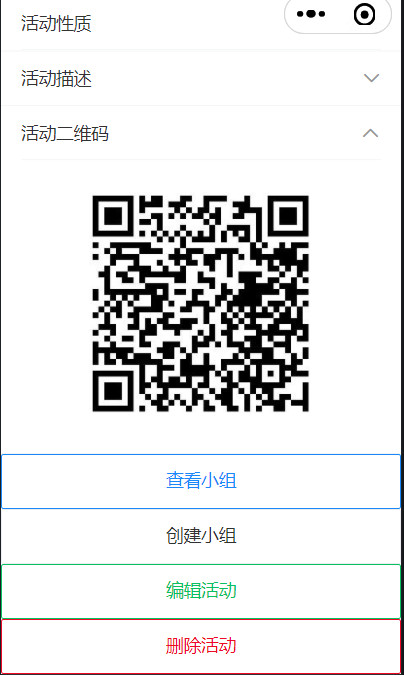
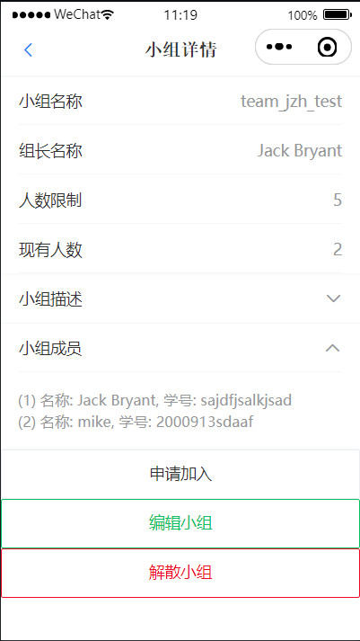
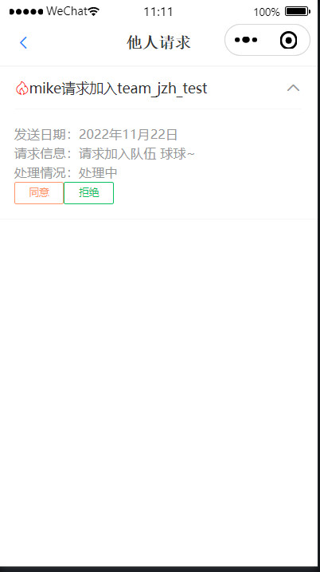

## 组队达人 (form-team-talent)

### 简介

一个简洁的小程序，可以快速，方便，高效地进行课外活动，课题研究，大作业等的组队。

[点击查看小程序展示](#show)

### 团队分工情况

- jzh：40%，后端代码和部分前端代码
- wfy：30%，界面设计和部分前端代码
- wyz：30%，负责文档，PPT的编写和部分前端代码

### 功能设计

每个人都可以通过组队达人创建一个活动，活动可以设置为私有活动或者公共活动，可以指定截止时间和具体内容，其他人可以通过扫描二维码加入活动。

加入活动页面，可以创建自己的小组，小组可以设置人数限制，说明小组的目标，对成员的要求等等。

活动参与者可以申请加入小组，说明自己的情况，以便组长筛选组员，组长同意申请之后就成功加入了小组。

每个人可以编辑自己的具体信息，以便了解和认识其他人。

### 技术设计

#### 一、后端技术概览：

主要通过 Java 实现，支持通过 Docker 快速部署。使用微信云托管部署服务，使用腾讯云COS（或阿里云OSS）存储静态文件，
通过 Redis 实现缓存，通过 Swagger3 构建 api 文档。

- SpringBoot
- Docker & Docker-compose
- MySQL
- Redis
- MybatisPlus
- Hutool
- JWT
- Quartz
- OkHttp
- qcloud.cos / aliyun.oss
- Swagger3

#### 二、前端技术概览：

主要由 JavaScript 实现。

只有微信小程序端，通过微信官方API和 **Vant Weapp** 框架搭建UI。

- WeChat API
- Vant Weapp

#### 三、关键技术点和问题：

**1、docker 部署问题**

如果不使用 docker-compose 部署服务，只通过 docker 进行部署的话，由于有多个容器需要部署且容器间需要通信，为了正常通信，需要建立桥接网络，通过创建一个 network（默认为 bridge 模式），将两个容器的网络均指定为该 network， 即可让两个容器互通。

对于 mysql 服务所在容器，假如容器名定为 mysqldb，那么在 java 后端配置文件里对应的 mysql 服务的 url 应该指定为 `jdbc:mysql://mysqldb/xxxxxxx`。这样才能顺利连通 mysql 服务。

当然，假如使用 docker-compose 则没有这个问题了。

**2、前后端交互认证问题**

微信小程序的认证流程大致是这样的：

**P1：** 在小程序端向用户申请获得用户信息的权限，用户同意后，微信服务器返回一个 code 授权码，小程序端携带该授权码访问后端认证接口。

**P2：** 后端通过该授权码访问微信提供的接口服务获得该用户的 openId，接着将 openId 通过 Jwt 进行加密生成 token，放入请求头中返回给小程序端。

**P3：** 小程序端将 token 存入本地，以后每次需要用户认证的请求都带上该请求头。后端尝试获取请求头中 token，如果 token 不存在或者 token 过期则向小程序端返回 token 失效的错误码。

**P4：** 如果小程序端收到 token 失效错误码后，则进行 P1 操作。

认证流程图如下所示：


**3、关于后端返回的 json 数据**

对于一个采用驼峰命名法命名的变量，比如 userId，转换后返回前端的 json 属性名是 userId，没有问题。

但是当变量名为 uId时，转换后则变为 uid，这就产生了问题。我还测试了其它一些变量，如下：

```
# userId
{"code":200,"msg":"ok","obj":{"userId":"hello"}}
# uId
{"code":200,"msg":"ok","obj":{"uid":"hello"}}
# Id
{"code":200,"msg":"ok","obj":{"id":"hello"}}
# uuId
{"code":200,"msg":"ok","obj":{"uuId":"hello"}}
```

可见当为 uId 和 Id 时，都会出现问题。

一般可以考虑在后端变量命名时，不让第二个字符大写，或者采用 `@JsonProperty("uId")` 进行解决。

**4. 建立适当的索引**

有些索引建立了反而会降低效率，比如写多于读的场景：在本项目中，对于一个加入小组的请求，写入到 t_req 表之后， 
撤销请求操作和处理请求操作都可能是较为频繁的，也就是增删行操作较多，可能导致索引频繁地进行重建。

在查询用户所加入的小组时，可以建立联合索引。由于某个小组隶属于某个活动，在 t_uat 表中，可以将用户编号，活动编号，小组编号（u_id, a_id, t_id）三者
建立一个联合索引，这样可以较好地提高效率。

### 后端开发步骤

将 `application.pub.yaml` 重命名为 `application.yaml`，然后开始编辑。（“xxxxxx...”为需编辑内容）

需要配置的内容：

- 微信小程序的 appId 和 appSecret
- 数据库用户和密码
- 对象存储相关字段
- 本地静态资源存储位置
- token 密钥和过期时间（单位：s）
- redis 基本配置
- 是否开启 swagger （生产环境下建议关闭）

执行 `init.sql` 初始化数据库，之后即可开始开发。

### 前端开发步骤

`mini-program` 为小程序开发目录，后端未使用微信云托管，需通过该文件夹开发。

`mini-program-cloud` 也为小程序开发目录，若后端使用了微信云托管，需通过该文件夹开发。

```
cd mini-program # or cd mini-program-cloud
npm init
npm install
```

然后，使用微信开发者工具进行npm构建即可。

接着，编辑 `app.js`，如下：

如果在 `mini-program` 开发，将“xxxxxx”替换为后端服务地址即可。

```js
App({
  globalData: {
    baseUrl: "xxxxxx",
  },
})
```

如果在 `mini-program-cloud` 开发，则需编辑如下内容（先将 app.pub.js 重命名为 app.js）：

```js
that.cloud = new wx.cloud.Cloud({
  resourceAppid: 'xxxxxxxxxxxxxxxxxx', // 微信云托管环境所属账号，服务商appid、公众号或小程序appid
  resourceEnv: 'xxxxxxxxxxxxxxxxxx', // 微信云托管的环境ID
})
```

之后，即可开始开发。

注：后端 api 地址为 `localhost:端口号/swagger-ui/index.html`

### 部署步骤

#### 方法1、通过 docker 部署

首先， docker 拉取 `mysql:5.7`

接着，编辑配置文件中 mysql 地址如下：

```
url: jdbc:mysql://mysqldb/form_team_talent?serverTimezone=UTC&useUnicode=true&characterEncoding=utf8
```

接着，编辑 `publish.sh` 中数据库密码（默认指定的是 root 的密码）。

最后，运行 `publish.sh -u`（-u 字段是为了重新生成 jar包），然后加入 mysql 容器运行数据库初始化脚本 `init.sql` 即可。

#### 方法2、通过 docker-compose 部署

首先，由于需要挂载文件卷，用于容器与主机之间共享文件，选用linux主机上的 `/docker/**` 作为共享点。

- /docker/mysql/data:/var/lib/mysql # 数据挂载
- /docker/mysql/conf:/etc/mysql/conf.d # 配置挂载
- /docker/mysql/init:/docker-entrypoint-initdb.d # 初始化sql挂载
- /docker/app/form-team-talent:/docker/app/form-team-talent # 存放静态文件，jar包，外部配置等
- /docker/redis/data:/data # redis 数据挂载
- /docker/redis/redis.conf:/usr/local/etc/redis/redis.conf # redis 配置文件挂载

注：挂载规则是{主机目录}:{容器目录}。

创建完以上对应目录后：

将 `init.sql` 放到 `/docker/mysql/init` 目录下。

将 `docker-compose-pub.yaml` 重命名为 `docker-compose.yaml`，然后编辑数据库密码即可（默认指定的是 root 的密码）。

接着，编辑配置文件中 mysql 地址如下：

```
url: jdbc:mysql://mysqldb/form_team_talent?serverTimezone=UTC&useUnicode=true&characterEncoding=utf8
```

最后，执行 `./publish.sh -u` （-u 字段是为了重新生成 jar包）。

#### 方法3、通过微信云托管部署

在数据库界面创建账号（对应数据库用户和密码），进入数据库管理界面，运行数据库初始化脚本 `init.sql` 即可。

在数据库界面获取数据库内网地址，然后编辑配置文件中 mysql 地址如下：

```
url: jdbc:mysql://数据库内网地址/form_team_talent?serverTimezone=UTC&useUnicode=true&characterEncoding=utf8
```

重新生成 jar 包。

最后，进入服务界面，创建服务，将jar包上传并部署（或采用 docker 的方式）。

<h3 id="show">小程序展示</h3>

**主页**


**个人页**


**管理页**


**活动页**




**小组页**



**请求**

发送加入小组的请求：


处理请求：




### 联系与交流

Github: [akynazh](https://github.com/akynazh)

QQ: 1945561232

Wechat: akynazh

Mail: 1945561232@qq.com
